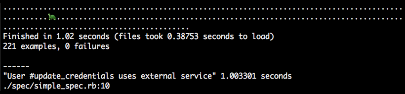

# YertleFormatter
[](http://badge.fury.io/rb/yertle_formatter)
[](https://travis-ci.org/edgibbs/yertle_formatter)
[](https://coveralls.io/r/edgibbs/yertle_formatter?branch=master)
[](https://codeclimate.com/github/edgibbs/yertle_formatter)
[](https://www.pullreview.com/github/edgibbs/yertle_formatter/reviews/master)
[](https://gemnasium.com/edgibbs/yertle_formatter)



An RSpec 3 formatter for highlighting slow specs.  Slow specs are marked with turtles (:turtle:) and a summary of slow specs are returned at the end of the run.

## Usage

Basic usage is like any other RSpec formatter:

    rspec --format YertleFormatter

Or to make it the default add the following to your .rspec file:

    require --format YertleFormatter

It defaults to defining slow specs as running longer than 0.2 seconds.  You can modify this by setting an environment variable:

    YERTLE_SLOW_TIME=1.0

Or you can add the configurable flag, yertle_slow_time, in your RSpec configuration:

```ruby
RSpec.configure do |config|
  config.yertle_slow_time = 1.0
end
```

## Installation

Add this line to your application's Gemfile:

    gem 'yertle_formatter'

And then execute:

    $ bundle

Or install it yourself as:

    $ gem install yertle_formatter

## Contributing

1. Fork it ( https://github.com/[my-github-username]/yertle_formatter/fork )
2. Create your feature branch (`git checkout -b my-new-feature`)
3. Commit your changes (`git commit -am 'Add some feature'`)
4. Push to the branch (`git push origin my-new-feature`)
5. Create a new Pull Request
